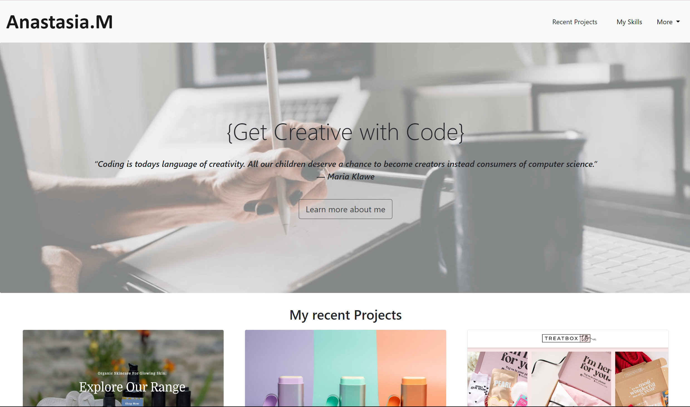
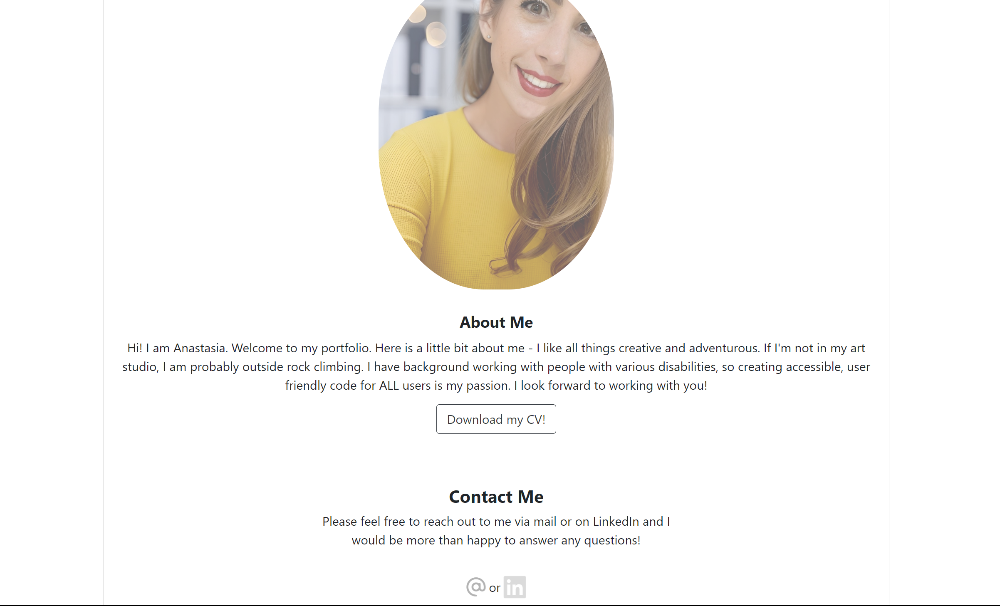
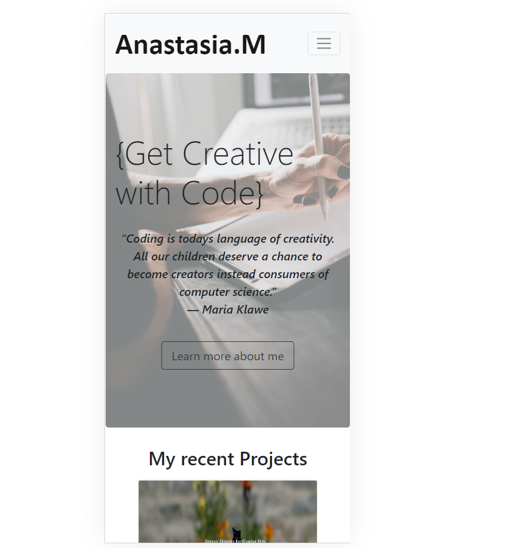

# Bootcamp Portfolio

I have been tasked with building a portfolio of my recent work including a profile and contact information - using bootstrap. This portfolio will be the perfect way to showcase my ability in a fun and interactive way.  

To complete this I will
*  Create a website that will include the following bootstrap components:
    - My name, featured in the logo in the top left of the page.
    - A Navigation bar that has links that are applicable to my portfolio and in working order.
    - A jumbotron which features a picture and an important slogan and quote. 
    - A work section which displays my work in grid. For the purpose of this project I will be using websites I like as placeholders and will not be taking actual credit for these websites.
    - Bootstrap cards for each project with a brief description and a working link to each website.
    - A skills section that lists the skills I expect to learn from the bootcamp, and some I already possess, within a drop down menu that explains a little about each one.
    - An about / contact section.
    - A footer section with interactive buttons.
    - All hyperlinks have a hover effect.
    - All buttons should display a box shadow upon hover.

## Installation

To open the project please follow this link: https://anamorai.github.io/portfolio-anastasiam/

## Usage 

Once you open the URL, you will see the following:

By clicking on the buttons in the top right, you can navigate to the sections further down within the page. 
It will look like this: 

The website is also mobile-friendly and will look like this on a phone:

## Badges

## Features

- Portfolio of my work with active links
- Responsive layout that adjusts to screensize
- Downloadable CV
- Live contact buttons
- Alt text for accessibility

## Credits

I would like to refrence EdX bootcamp and the tutors associated for the support I have recieved for this project. 

I would also like to give reference my previous portfolio project that I used as inspiration for this work. 

## License

MIT License

Copyright (c) [2023] [Anastasia Moraites]

Permission is hereby granted, free of charge, to any person obtaining a copy
of this software and associated documentation files (the "Software"), to deal
in the Software without restriction, including without limitation the rights
to use, copy, modify, merge, publish, distribute, sublicense, and/or sell
copies of the Software, and to permit persons to whom the Software is
furnished to do so, subject to the following conditions:

The above copyright notice and this permission notice shall be included in all
copies or substantial portions of the Software.

THE SOFTWARE IS PROVIDED "AS IS", WITHOUT WARRANTY OF ANY KIND, EXPRESS OR
IMPLIED, INCLUDING BUT NOT LIMITED TO THE WARRANTIES OF MERCHANTABILITY,
FITNESS FOR A PARTICULAR PURPOSE AND NONINFRINGEMENT. IN NO EVENT SHALL THE
AUTHORS OR COPYRIGHT HOLDERS BE LIABLE FOR ANY CLAIM, DAMAGES OR OTHER
LIABILITY, WHETHER IN AN ACTION OF CONTRACT, TORT OR OTHERWISE, ARISING FROM,
OUT OF OR IN CONNECTION WITH THE SOFTWARE OR THE USE OR OTHER DEALINGS IN THE
SOFTWARE.